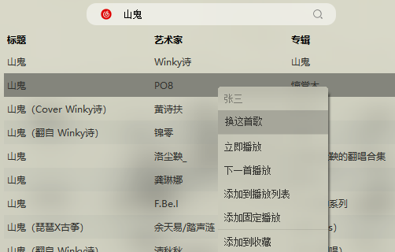
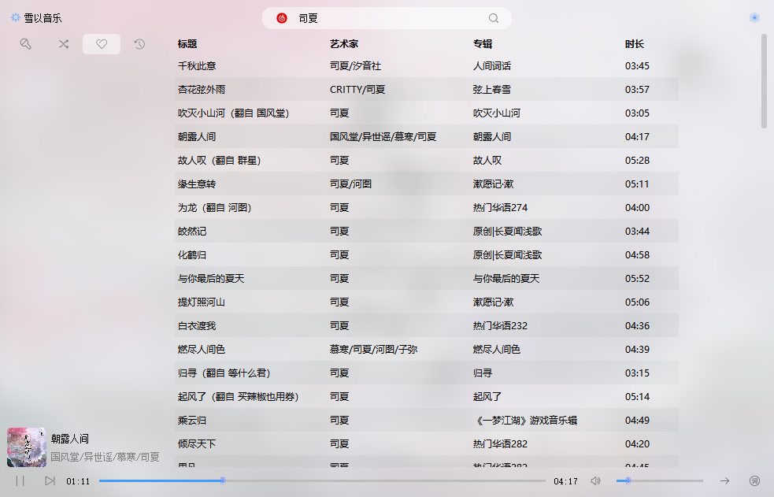
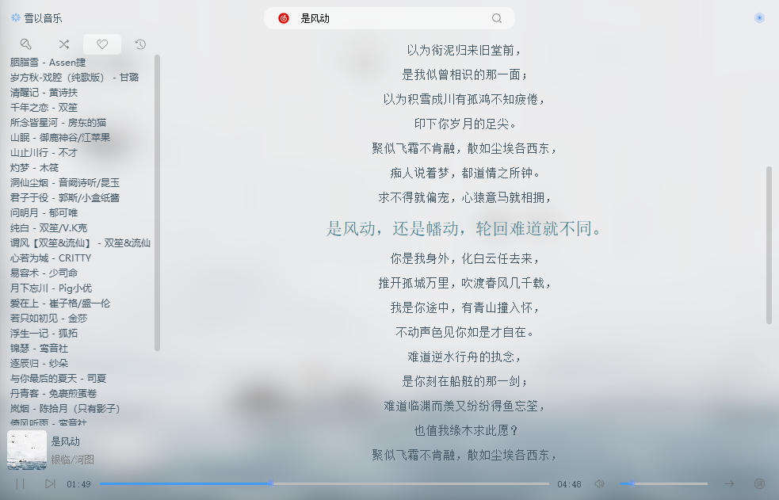
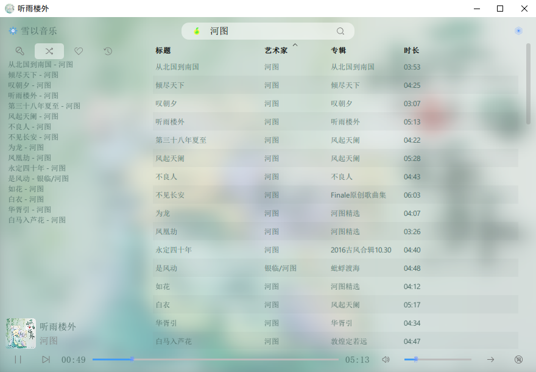
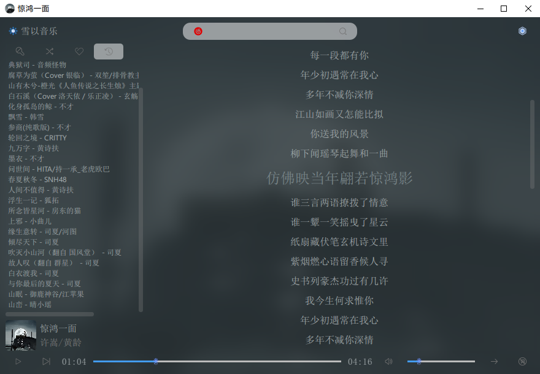
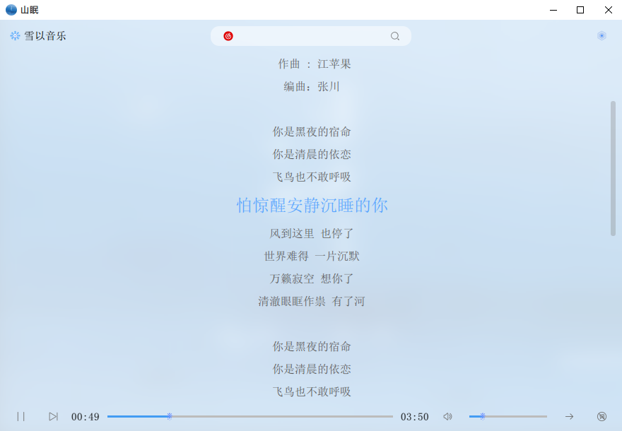
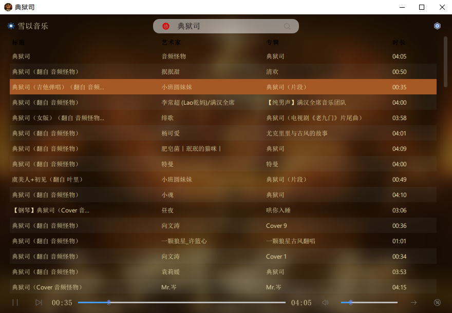
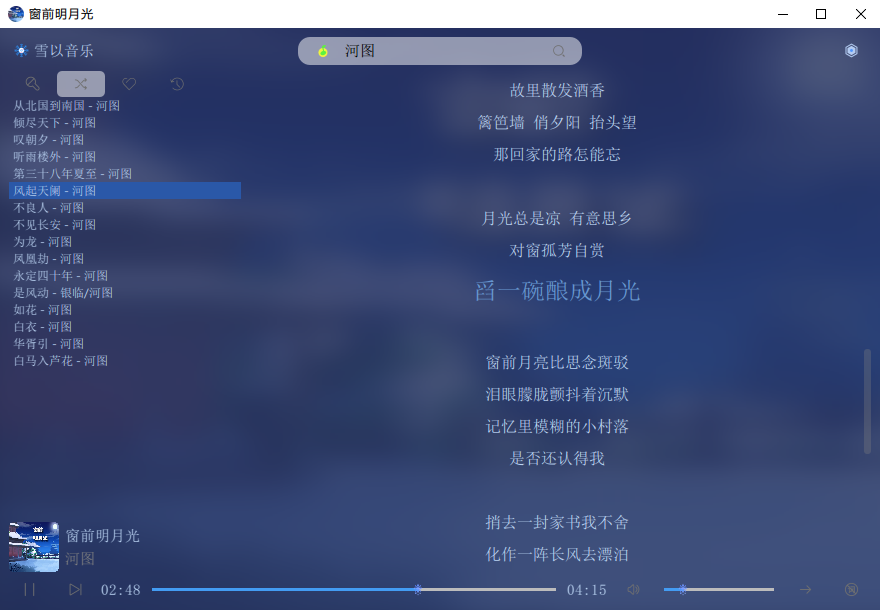

雪以音乐
===

——[神奇弹幕](https://github.com/iwxyi/Bilibili-MagicalDanmaku)点歌姬插件

同时支持网易云音乐、QQ音乐，并在没有版权的时候自动切换至另一音源。

可作为轻量级插件嵌入需要点歌的程序，通过信号槽点歌、接收点歌成功通知。

## 功能

- 音源自动切换
- 按关键词搜索
- 智能分析歌名
- 点歌自动搜索
- 点歌播放队列
- 固定播放队列
- 点歌防止刷屏
- 预计时长回复
- 背景封面模糊
- 提取主题色调
- 查看桌面歌词
- 收藏夹与历史
- 一键导入歌单
- 网易会员登录

## 详细介绍

### 点歌技巧

通过[弹幕姬](https://github.com/iwxyi/Bilibili-MagicalDanmaku)点歌的歌曲，会在雪以音乐中自动搜索，**智能挑选**最合适的歌曲，添加到点歌列表。

#### 自动换源

目前支持网易云音乐、QQ音乐。若播放的歌曲在当前音源没有版权，**自动切换至另一音源**

#### 会员歌曲

已支持网易云音乐的平台账号登录，若是VIP会员，可播放VIP歌曲

#### 指定歌手

通过 “**点歌 歌名 歌手**” 或“**点歌 歌名-歌手**”的形式，指定该歌曲的歌手（若未找到，则播放第一首歌）。

#### 换这首歌

当播放的歌曲不是想点的歌时，可在搜索结果的右键菜单中，选择“换这首歌”，立刻替换为新的歌曲，自动删掉不想要的歌。

> 若不是通过点歌自动搜索的结果，将不会显示“点歌用户”和“换这首歌”菜单

#### 试听歌曲

在菜单中开启“试听接口”，可**试听QQ音乐会员歌曲一分钟**；网易云默认开启试听

### 点歌与固定播放

左上角四个tab，分别是：

- 点歌：按点歌时间自动添加的歌曲，自动播放
- 固定歌曲：点歌播放结束后，将随机播放固定歌曲（建议导入歌单到这里）
- 收藏：手动添加到收藏，快速播放
- 历史：所有歌曲的播放历史

所有列表均支持任意**多选**操作。

### 导入歌单链接

在大部分歌曲列表的右键菜单，可找到“打开分享的歌单”，输入网易云音乐、QQ音乐的歌单链接，显示歌单中的所有歌曲。与搜索结果一样，可任意多选播放、点歌、收藏等等。

> 未测试超过1000首歌的歌单，可能显示不全

## 截图预览

## 特别鸣谢

- 我自己：
  - [InteractiveButtons](https://github.com/iwxyi/Qt-InteractiveButtons)
  - [FacileMenu](https://github.com/iwxyi/Qt-FacileMenu)
  - [ImageThemeExtraion](https://github.com/iwxyi/ImageThemeExtraction)

- [Binaryify/NeteaseCloudMusicApi](https://github.com/Binaryify/NeteaseCloudMusicApi)
- [rain120/qq-music-api](https://github.com/rain120/qq-music-api)
